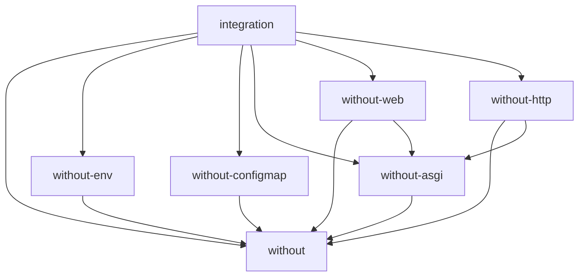

# without

A decoupled-IO substrate for connecting streams of events to stateful processors
backed by contexts, aiming for maximum concurrency from testable,
dependency-injected code. I/O is not banned, it is separated into the right
abstractions (sources at the edge, behaviors via `sample`, effects contained in
a processor's step) so the parts stay reusable.

The bet: Python has many frameworks with similar-but-subtly-different shapes
(ASGI apps, Kafka consumers, asyncio protocols, config reloaders) that do not
interoperate because none of them names the shared lower layer. `without` names
that layer as a narrow contract, so the pieces compose. It is meant to feel like
a library (your control flow stays visible) rather than a framework.

See `plans/BIG_IDEA.md` for the original pitch and `plans/REVIEW_BIG_IDEA.md` for the
critical review and open questions.

## Layout

This is a `uv` workspace of flat, version-locked packages (no namespace
packages). Each package is its own top-level import.

- `packages/without` — the core: the contracts every plugin speaks
  (`without.contracts`), the stream edge connectors (`without.wiring`), and a
  `with`-scoped background task helper (`without.tasks`). Imported as `without`.
- `packages/without-env` — first plugin: a static `Context` parsed from
  environment variables (`pydantic-settings`). Imported as `without_env`.
- `packages/without-configmap` — config from a Kubernetes mount (`watchfiles` +
  `pydantic`); the context-updated-by-a-stream half of the model. Imported as
  `without_configmap`.
- `packages/without-asgi` — adapters that turn an ASGI app's `receive`/`send`
  into typed event streams and back, in *both* directions (so it serves an app
  adapter and an ASGI server equally). The boundary only, no routing or
  framework. Imported as `without_asgi`.
- `packages/without-web` — an opinionated HTTP/WebSocket router over
  `without-asgi`: trie matching, typed path params, 405-vs-404, mounting, scoped
  middleware, exception handlers, and OpenAPI. Imported as `without_web`.
- `packages/without-http` — an `asyncio` ASGI **server** (and HTTP client) built
  on the sans-IO `h11`/`h2`/`wsproto` state machines: `serving(app)` owns the socket
  and the wire protocol (HTTP/1.1, HTTP/2, and WebSockets) and drives any ASGI app.
  Imported as `without_http`.
- `packages/integration` — not a real package (and never published: its name
  sits outside the `without*` family, so the publish workflow skips it): depends
  on `without` and every plugin so they can be exercised together in
  cross-package tests. Imported as `integration`.

The package dependency graph (each arrow is "depends on"):



Planned plugins, in the order they should be attempted:

1. `without-env` — config from env vars; a static context. **(done)**
2. `without-configmap` — config from a k8s mount (`watchfiles` + `pydantic`);
   proves the context-updated-by-a-stream loop. **(done)**
3. a toy line-protocol server (Redis-ish); proves long-lived processor state.
   **(done: `integration.kv`)**
4. HTTP (sans-IO deps); the real test of the contract. **(done: `without-asgi`
   adapters, the `without-web` router, and `without-http` (an `h11`/`h2`/`wsproto`
   ASGI server plus client, serving HTTP/1.1, HTTP/2, and WebSockets). HTTP/3 and
   WebSockets-over-HTTP/2 are documented fast-follows.)**

## Development

```bash
uv sync
just test    # mypy + pytest
```
