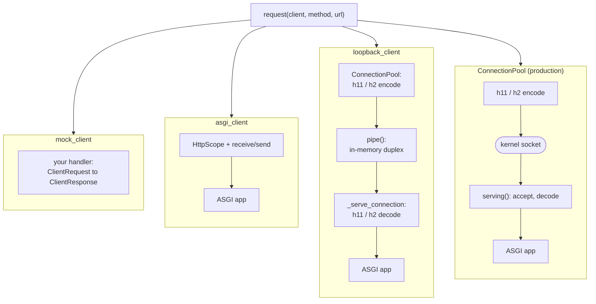
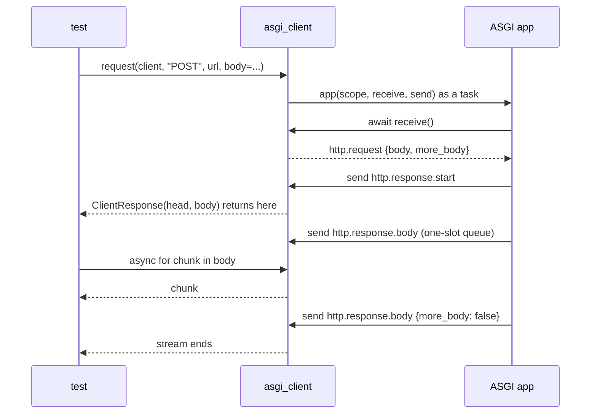
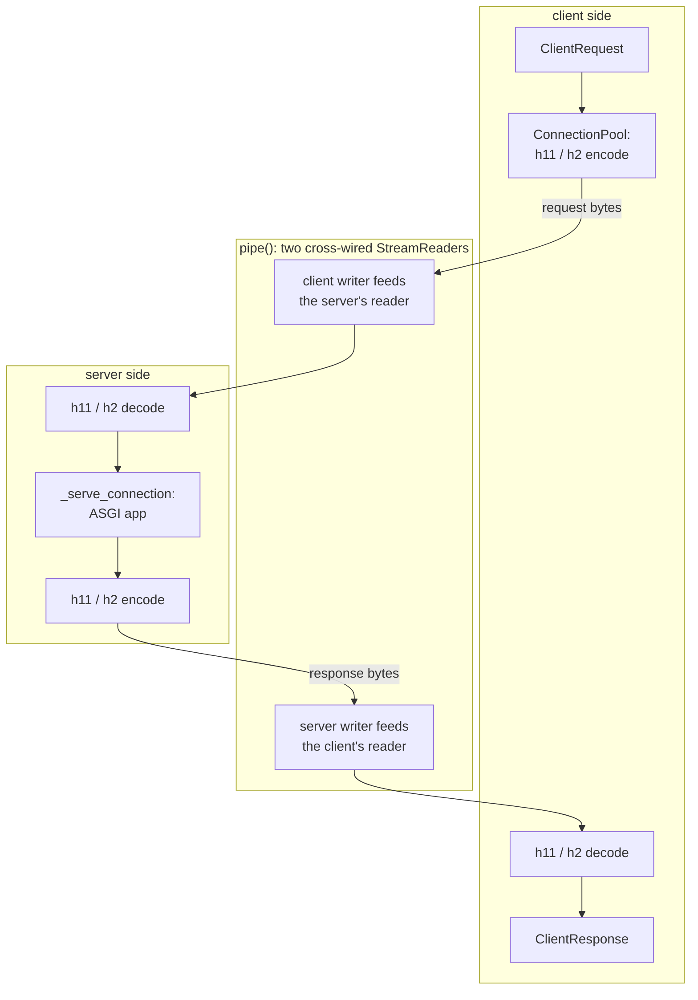
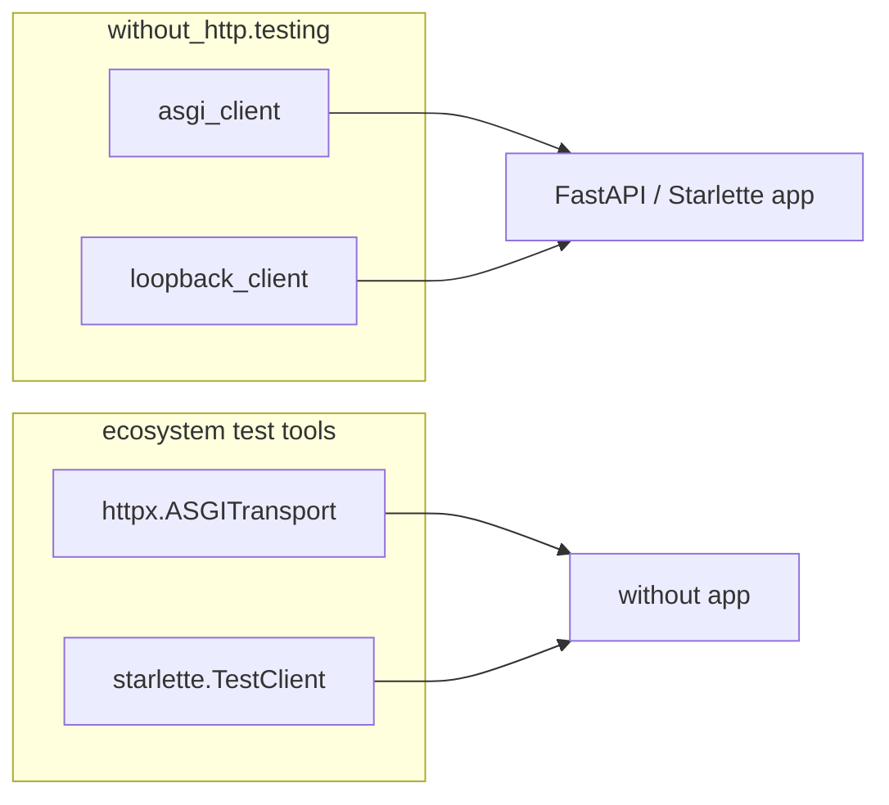

# Testing

How to test code that answers HTTP requests, and code that sends them, without binding
a socket. This page covers the three clients in `without_http.testing`, how much of the
stack each one runs, the raw endpoints underneath them for a test that writes bytes, and
how all of it interoperates with the ecosystem's own test tools. For the client interface
itself, see the [guide](index.md#client).

## One interface, four altitudes

A `Client` is a function from a request to a response, so *everything* that answers a
request is one and they are interchangeable. The test above them never changes; the only
choice is how much of the stack sits underneath.

The four below are not four layers, since they do not stack on each other. They are four
*altitudes*: each enters the same stack of layers (pool, wire codec, connection, server,
app) at a different depth, and the mock stands outside it entirely.



Only the last one touches the kernel. The first three open no socket, bind no port, and
hold no file descriptor, which is what lets a suite run them at full speed and in
parallel without port churn.

| | reaches an app | HTTP framing | connection reuse | TLS | socket |
|---|---|---|---|---|---|
| `mock_client` | no | no | no | no | no |
| `asgi_client` | yes | no | no | no | no |
| `loopback_client` | yes | yes | yes | no | no |
| `ConnectionPool` | yes | yes | yes | yes | yes |

Pick the leftmost column that still covers what the test is about: a mock when the
subject is code that *sends* requests, `asgi_client` when it is an app's behaviour,
`loopback_client` when it is anything the wire does, and a real `serving()` when it is
the socket itself.

URLs stay absolute at every altitude, exactly as they are for a `ConnectionPool`, so
swapping the client is the only edit between an in-memory test and one against a live
server. Compose `base_url("http://testserver")` if you would rather write `"/items"`.

## `mock_client`: answer without an app

To test code that *sends* requests, hand it a client that answers from a function.

```python
from without_http import ClientRequest, ClientResponse
from without_http.testing import mock_client, respond


def answer(request: ClientRequest) -> ClientResponse:
    if request.url == "https://api.test/rates":
        return respond(200, body=b'{"usd": 1.0}')
    raise AssertionError(f"unexpected request to {request.url}")


report = await summarize(mock_client(answer))
```

There is no mechanism here beyond the interface: a client is a function from a request
to a response, so a mock *is* one, and the "transport" a mocking library would have to
invent is a parameter you already pass. An unmatched request raises rather than
returning a default, so a call nobody planned for fails where it happens.

`respond(...)` builds the canned `ClientResponse`. Call it *inside* the handler: a
response body is a stream consumed exactly once, so one response value cannot serve two
requests.

Because a mock is a client, it composes like one. Wrapping it in the same middleware the
production client uses tests the middleware too:

```python
jar = CookieJar()
client = stack(follow_redirects(), cookies(jar))(mock_client(answer))
```

## `asgi_client`: drive an app with no wire

```python
from without_http import request
from without_http.testing import asgi_client

async with asgi_client(app) as client:
    async with request(client, "GET", "http://testserver/items") as (head, body):
        assert head.status == 200
        assert await body.read() == b"[]"
```

Each request builds an `HttpScope` from the `ClientRequest` and calls
`app(scope, receive, send)` on a task of its own, with two closures standing in for the
transport:



Three consequences of that shape are worth knowing, because they are what a buffering
transport cannot give you:

- **The response streams.** The head returns the instant the app sends
  `http.response.start`, before any body chunk exists, and each chunk crosses a one-slot
  queue (the in-memory stand-in for a socket buffer, so an app that runs ahead of a slow
  reader blocks in `send`). A handler that reads the request body while writing its
  response, or one that long-polls, behaves as it would on the wire.
- **The lifespan runs.** `asgi_client` is a context manager because it wraps the same
  `run_lifespan` a real server uses, so state built at startup is in place before the
  first request and torn down after the last.
- **Trailers arrive.** The scope advertises `http.response.trailers`, and nothing else,
  because a `ClientResponse` carries trailing blocks through to `read_with_trailers`.
  An app that negotiates the extension takes its trailer path here, in the extension's
  own order: the trailing blocks come *after* the final `http.response.body`, and the
  last of them ends the response. The server-offload extensions (server push, zero-copy
  and path send) have a kernel or a proxy to offload to and nothing in memory does, so
  sending one of their events raises, as it does over HTTP/1.1.

An exception from the app surfaces to the caller rather than becoming a `500`. There is
no server here to convert it, and swallowing it would hide the failure; use
`loopback_client` when the `500` itself is the thing under test.

## `loopback_client`: the real wire, no socket

```python
from without_http.testing import loopback_client

async with loopback_client(app) as client:  # or loopback_client(app, http2=True)
    async with request(client, "GET", "http://testserver/boom") as (head, body):
        assert head.status == 500  # the server's own isolation
```

This is `serving` minus `asyncio.start_server`. The production `ConnectionPool` encodes
the request, the server's own connection loop decodes it and drives the app, and the
bytes cross a `pipe()` instead of the kernel:



`pipe()` returns two connected `(reader, writer)` endpoints: each transport's `write`
feeds the peer's `StreamReader`, `write_eof`/`close` feed it EOF (the half-close the wire
protocols read as "the peer is done sending"), and a reader whose buffer fills pauses the
peer's writer, so `drain()` blocks exactly as it would on a socket. It is a connection,
not a buffer.

A write once either end has closed is dropped rather than delivered, which is what makes
the keep-alive race behave: a pool that checks a pooled connection for EOF and then writes
can have the close land in between, and a socket takes those bytes and reports the failure
on the next read.

### `served_pipe`: the server, with the bytes left to you

A conformance test writes frames rather than requests: a malformed request line, an h2
preface followed by an illegal frame, a `RST_STREAM` flood. `served_pipe` is the same
wiring as `loopback_client` with the client half left off, handing the raw endpoint over
instead:

```python
async with served_pipe(app, max_stream_resets=2) as (reader, writer):
    writer.write(b"!!! not a valid request line !!!\r\n\r\n")
    await writer.drain()
    assert (await reader.readline()).startswith(b"HTTP/1.1 400")
```

It runs the lifespan and cancels the connection on exit, both as `serving` does, so a
test can still assert what shutdown does to a request left in flight. The server reads
`SERVER_ADDRESS` back as its own address, which is the authority such a test writes into
`:authority` or a `Host` header. This is what `without-http`'s own HTTP/1.1 and HTTP/2
server suites run on.

So `loopback_client` covers everything `asgi_client` skips: framing and chunking,
keep-alive and connection reuse, HTTP/2 by prior knowledge (`http2=True` makes the client
write the h2 preface, which the server recognizes), the `413`/redirect early-response
path, and the server turning a crashing handler into a `500`. It takes `serving`'s
per-connection bounds (`idle_timeout`, `max_concurrent_streams`, ...) with the same
defaults.

What it cannot reproduce is what only a kernel provides:

- **TLS.** There is no handshake to negotiate, so an `https` URL raises rather than
  silently downgrading to cleartext.
- **Abortive close.** A pipe has no `RST`, so the difference between an orderly `FIN`
  and a reset is invisible.
- **The accept path.** No listen backlog, no bind, no address in use.

Tests that turn on any of those belong on `serving()` and a real socket, which is what
`without-http`'s TLS suite, its socket-option tests, and the tests driven by a
third-party client still bind.

## A client finishing is not the app finishing

A response is complete when its last body event is on the wire, which can be *before* the
handler that produced it has run to its own end. The gap is real work: a handler streaming
a file with `file_response` reads each chunk on a worker thread, so ending its stream costs
one more thread hop after the final chunk was sent. Meanwhile the client already has every
byte it was promised and returns.

That matters at teardown, because leaving the client's block closes its connections and
cancels whatever they were still running, the same thing `serving()` does at shutdown. So
a test that asserts something the handler does *after* its last response event, a cleanup,
a metric, a write, must wait for the handler to say so rather than for the response:

```python
drained = asyncio.Event()  # set by the handler after its stream ends

async with loopback_client(app(drained)) as client:
    async with request(client, "GET", "http://testserver/download") as (head, body):
        assert await body.read() == payload
    await drained.wait()
```

Waiting on the app's own signal is what makes this deterministic. Reaching instead for a
faster or slower client, or a sleep, only changes how often the race is won.

## Interoperating

All of this speaks plain ASGI and plain request/response values, so it crosses the
ecosystem boundary in both directions.



`asgi_client` and `loopback_client` drive a FastAPI or Starlette app as readily as a
`without` one, because an ASGI app is an ASGI app. In the other direction, a `without`
app is a plain ASGI app, so `httpx.ASGITransport` and starlette's `TestClient` drive it
unchanged. Both directions are pinned by tests in `packages/integration`.

The one thing to carry over from those tools is what they leave out. `httpx.ASGITransport`
never runs the lifespan protocol, so an app whose state is built at startup needs
`run_lifespan` around it:

```python
app = make_asgi_app(lifespan, http=router.dispatch)
async with run_lifespan(app), httpx.AsyncClient(transport=httpx.ASGITransport(app)) as client:
    ...
```

It also buffers the whole response before returning it, so streaming and duplex
behaviour are not observable through it. Starlette's `TestClient` closes the lifespan
gap, and adds a background event loop in a portal thread so *synchronous* tests can
drive an async app, but it buffers the same way: it runs the app to completion and then
builds the response from what was collected, so the head cannot arrive before the last
chunk and a duplex handler has nothing to read. `without`'s suite is async throughout,
so `asgi_client` needs no thread: what it keeps from `TestClient` is the lifespan
bracket, and what it adds is the streaming response.

## Reference

The module ships inside `without-http` but is not re-exported from its top level, so it
is imported explicitly (`from without_http.testing import asgi_client`) and adds nothing
to what a production import pulls in.

::: without_http.testing
